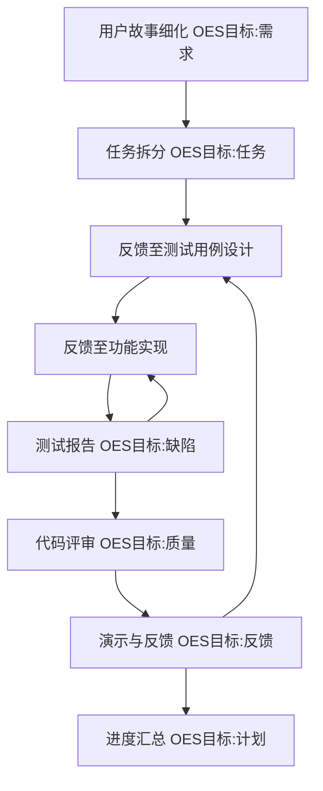

# AceFlow 流程规范 v3.4

AceFlow 是一个结构化的工作流程，通过阶段划分、模板使用和协作规范来提升团队效率。流程分为多个阶段（S1 至 S8），每个阶段有明确的目标、环境和成功标准。AceFlow 强调文档化、版本控制和团队协作，确保项目进展可追溯且一致。

## 核心原则
1. **阶段化**：项目分解为多个阶段，各阶段聚焦特定目标。
2. **模板化**：统一模板确保文档一致性。
3. **可追溯性**：变更记录和版本控制追踪演变。
4. **协作性**：明确责任分配和沟通机制。
5. **自动化**：AI 和工具减少人工负担。
6. **质量驱动**：基于 TDD 和多层次测试确保质量。
7. **注意力驱动**：通过机制引导 AI 聚焦当前任务和阶段。
8. **动态时间分配**：根据任务复杂度评分动态调整阶段时间。
9. **异常处理规范**：清晰定义潜在问题及解决方案。

## 流程阶段定义
AceFlow 流程分为 8 个阶段，并结合 OES 方法进行优化设计：

### S1：用户故事细化
- **目标 (Objective)**：
  - 将需求转化为用户故事。
  - 产出符合模板的用户故事文档 `<iterationRoot>/s1_user_story.md`。
- **环境 (Environment)**：
  - 输入：产品需求文档（PRD）、用户旅程设计。
  - 使用模板：`<docDir>/templates/user_story.md`。
- **成功标准 (Success Criteria)**：
  - 用户故事覆盖所有需求。
  - 文档通过团队评审。
- **责任人**：
  - 用户。
- **完成声明**：
  - 用户故事细化完成，文档已提交至 `<iterationRoot>/s1_user_story.md` 并通过评审。
  - **任务状态表更新**：生成任务状态表 `task_status_table.md`，记录阶段状态和任务列表。

---

### S2：任务拆分
- **目标 (Objective)**：
  - 将用户故事转化为开发任务。
  - 产出任务拆分文档 `<iterationRoot>/s2_tasks.md`。
- **环境 (Environment)**：
  - 输入：`<iterationRoot>/s1_user_story.md`。
  - 使用模板：`<docDir>/templates/task.md`。
- **成功标准 (Success Criteria)**：
  - 任务列表清晰、完整。
  - 每个任务分配责任人和优先级。
- **责任人**：
  - AI coder 或用户。
- **完成声明**：
  - 任务拆分完成，文档提交至 `<iterationRoot>/s2_tasks.md`。
  - **任务状态表更新**：更新任务状态表 `task_status_table.md`，记录任务状态及责任人。

---

### S3：测试用例设计
- **目标 (Objective)**：
  - 基于用户故事设计测试用例，驱动 TDD 流程。
  - 产出测试用例文档 `<iterationRoot>/s3_testcases.md` 和测试代码框架。
- **环境 (Environment)**：
  - 输入：`<iterationRoot>/s1_user_story.md`、`<iterationRoot>/s2_tasks.md`。
  - 使用模板：`<docDir>/templates/test_case.md`。
- **成功标准 (Success Criteria)**：
  - 测试用例覆盖所有用户故事。
  - 测试代码框架符合质量标准。
- **责任人**：
  - AI coder。
- **完成声明**：
  - 测试用例设计完成，文档提交至 `<iterationRoot>/s3_testcases.md`。
  - 测试代码框架已生成并提交至 `<testsDir>/frontend/` 和 `<testsDir>/backend/`。
  - **任务状态表更新**：更新任务状态表 `task_status_table.md`，记录测试相关任务的进展。

---

### S4：功能实现
- **目标 (Objective)**：
  - 实现功能代码，遵循 TDD。
  - 产出功能实现文档 `<iterationRoot>/s4_implementation.md` 和实际代码文件。
- **环境 (Environment)**：
  - 输入：`<iterationRoot>/s2_tasks.md`、`<iterationRoot>/s3_testcases.md`。
  - 使用模板：`<docDir>/templates/implementation.md`。
- **成功标准 (Success Criteria)**：
  - 单元测试通过率至少 90%。
  - 集成测试覆盖主要功能模块。
  - 前端代码提交至 `<srcDir>/frontend/`。
  - 后端代码提交至 `<srcDir>/backend/`。
- **责任人**：
  - AI coder。
- **完成声明**：
  - 功能实现完成，文档提交至 `<iterationRoot>/s4_implementation.md`。
  - **任务状态表更新**：更新任务状态表 `task_status_table.md`，记录功能开发任务的完成状态。

---

### S5：测试报告
- **目标 (Objective)**：
  - 执行测试，确保质量验收。
  - 产出测试报告文档 `<iterationRoot>/s5_test_report.md`。
- **环境 (Environment)**：
  - 输入：`<iterationRoot>/s3_testcases.md`、代码、`<iterationRoot>/s4_implementation.md`。
  - 使用模板：`<docDir>/templates/test_report.md`。
- **成功标准 (Success Criteria)**：
  - 测试结果记录完整，包括覆盖率和缺陷。
  - 无高严重度缺陷。
- **责任人**：
  - AI coder。
- **完成声明**：
  - 测试报告完成，文档提交至 `<iterationRoot>/s5_test_report.md`。
  - **任务状态表更新**：更新任务状态表 `task_status_table.md`，记录测试结果及发现的缺陷。

---

### S6：代码评审
- **目标 (Objective)**：
  - 确保代码质量和规范。
  - 产出代码评审文档 `<iterationRoot>/s6_codereview.md`。
- **环境 (Environment)**：
  - 输入：代码、`<iterationRoot>/s4_implementation.md`、`<iterationRoot>/s5_test_report.md`。
  - 使用模板：`<docDir>/templates/code_review.md`。
- **成功标准 (Success Criteria)**：
  - 代码通过质量检查。
  - 无重大缺陷。
- **责任人**：
  - 用户。
- **完成声明**：
  - 代码评审完成，文档提交至 `<iterationRoot>/s6_codereview.md`。
  - **任务状态表更新**：更新任务状态表 `task_status_table.md`，记录代码评审任务的状态。

---

### S7：演示与反馈
- **目标 (Objective)**：
  - 演示功能，收集反馈。
  - 产出反馈文档 `<iterationRoot>/s7_demo_feedback.md`。
- **环境 (Environment)**：
  - 输入：`<iterationRoot>/s5_test_report.md`、代码。
  - 使用模板：`<docDir>/templates/demo_feedback.md`。
- **成功标准 (Success Criteria)**：
  - 功能演示成功。
  - 反馈分类明确，建议可操作。
- **责任人**：
  - 用户。
- **完成声明**：
  - 演示与反馈完成，文档提交至 `<iterationRoot>/s7_demo_feedback.md`。
  - **任务状态表更新**：更新任务状态表 `task_status_table.md`，记录反馈问题及建议。

---

### S8：进度汇总
- **目标 (Objective)**：
  - 总结进展，规划下一步。
  - 产出进度报告文档 `<iterationRoot>/s8_progress_index.md`。
- **环境 (Environment)**：
  - 输入：所有阶段文档、`<iterationRoot>/s7_demo_feedback.md`。
  - 使用模板：`<docDir>/templates/progress_index.md`。
- **成功标准 (Success Criteria)**：
  - 进度报告完整，目标评估清晰。
- **责任人**：
  - 用户。
- **完成声明**：
  - 进度汇总完成，报告提交至 `<iterationRoot>/s8_progress_index.md`。
  - **任务状态表更新**：更新任务状态表 `task_status_table.md`，记录阶段总结及未来规划。
---

## 阶段间反馈循环
AceFlow 阶段之间增加反馈循环，确保问题能够快速反馈至相关阶段处理。例如：
- 在 S5 阶段发现测试缺陷，可立即返回 S4 阶段修复。
- 在 S7 阶段发现用户体验问题，可返回 S3 阶段重新设计测试用例。

## 动态时间分配机制
根据任务复杂度评分（满分 10），动态调整阶段时间分配：
- **简单任务（评分 ≤ 3）**：
  - S1-S3 阶段占 40%，S4-S5 阶段占 50%，S6-S8 阶段占 10%。
- **中等任务（评分 4-7）**：
  - S1-S3 阶段占 30%，S4-S5 阶段占 60%，S6-S8 阶段占 10%。
- **复杂任务（评分 ≥ 8）**：
  - S1-S3 阶段占 20%，S4-S5 阶段占 70%，S6-S8 阶段占 10%。

## 异常处理规范
为每阶段定义潜在异常及解决方案：
- **S4 功能实现**：
  - 异常：单元测试无法通过。
  - 解决方案：记录详细日志，分析失败原因，重新设计测试用例。
- **S5 测试报告**：
  - 异常：发现高严重度缺陷。
  - 解决方案：返回 S4 阶段修复代码，重新运行相关测试。
- **S7 演示与反馈**：
  - 异常：用户反馈与预期不符。
  - 解决方案：返回 S3 阶段重新设计测试用例，确保覆盖用户体验场景。

---

## 补充说明
- **目录结构说明**：根据项目配置，迭代文档存储在 `<iterationRoot>` 目录下，具体路径由 'aceflow/project.config.json' 定义（例如 'aceflow_result/iterations/'）。测试文件存储在 `<testsDir>`（例如 'aceflow_result/tests/'），源代码存储在 `<srcDir>`（例如 'teamwiki/src/'）。
- **状态文件位置**：项目状态文件 'status.md' 建议存储在 'aceflow_result/' 目录下，作为项目总体状态的概览，方便团队查看和管理。

---

> 本文档为 AceFlow 流程规范 v3.4，已根据 OES 方法论优化，供 AI 和团队使用。

最后更新：2025-07-01 02:41:28 UTC+8  
当前用户：@jackycchen
