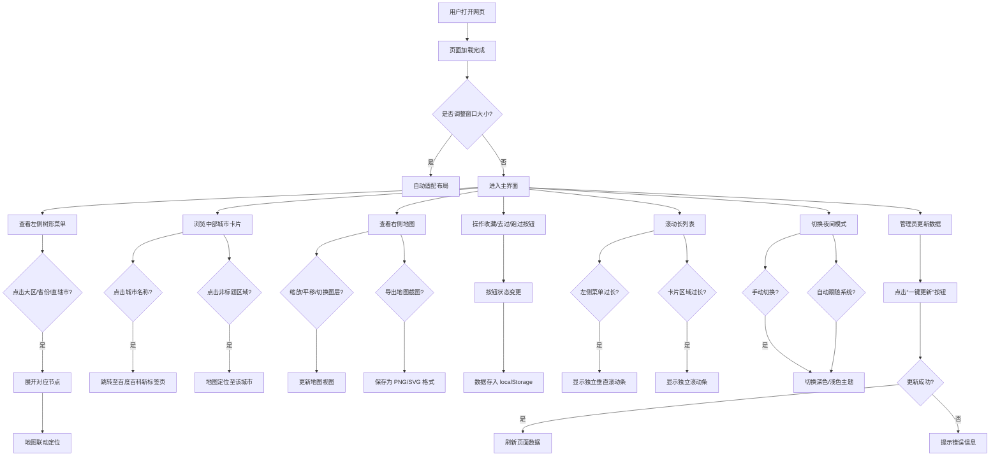

# 用户体验流程图文档

以下为基于 [user_journey.md](file://c:\Users\Semi-HuDP\Desktop\China\docs\user_journey.md) 的用户体验流程图代码，采用 Mermaid.js 格式编写，可用于可视化渲染。

## 🧭 用户旅程流程图（Mermaid 格式）

---

## 📝 使用说明

### 如何渲染流程图
1. 打开支持 Mermaid 的编辑器（如 Typora、VSCode + Mermaid 插件、Mermaid Live Editor）
2. 将上述代码粘贴到编辑器中
3. 实时预览或导出为 HTML/PNG/PDF

### 可扩展建议
- **拆分为多个子流程图**：可将城市浏览、地图操作、状态管理等流程单独提取成图
- **添加样式与注释**：可在 Mermaid 中加入 `classDef` 定义不同类型的节点样式
- **导出为图像文件**：在 Mermaid 编辑器中直接导出为 PNG 或 SVG 文件用于演示或文档集成

---

**文档版本**：1.0
**最后更新日期**：2025年7月10日
**编写人**：Lingma（灵码）